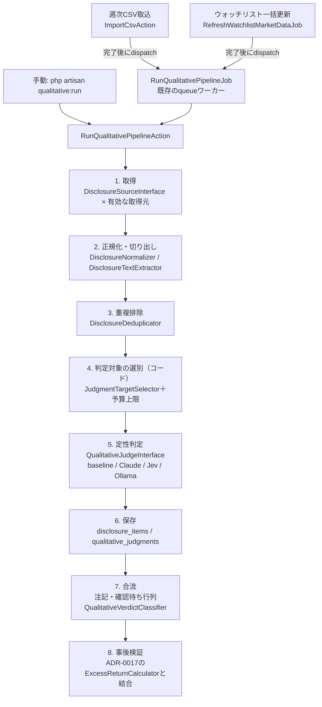

# CHG-0049: 定性判定のアプリ組み込み設計（叩き台）

> 状態: **叩き台（2026-10-08）。本人未承認・Gate 1前。アプリコードは未変更。**
> 親文書: [変更要求案](qualitative-signal-proposal.md)・[PoC検証計画](qualitative-signal-poc-validation-plan.md)・[PoCの結果](qualitative-signal-poc-results.md)
> 位置づけ: 段階0（PoC）で**GOになった用途がある場合だけ**、Gate 1（`requirements.md`）・Gate 2（`use-cases.md`と画面案）・Gate 3（`data-model.md`とADR-0028/0029）の**入力**として使う。PoCがNO-GOなら、この文書は見送りの記録として残すだけにする。本書のどの記述も承認ではない。
> 確認方法: 2026-10-08時点のmainのコードと設計文書を読んで書いた。実在を確認したファイルはパスで示す。確認できなかった点は「要確認」と書く。

## 0. 前提と方針

- **最終判断は既存のルール判定が持つ**（変更要求案 §3.2）。定性判定は「注記」「ログのみ」「確認待ち行列」の3区分にだけ影響させ、`signals`・`buy_signals`・`watchlist_buy_signals`の削除→再作成と、バケツ分類（`ClassifyHoldingsAction`）には触れない。
- **AIを使わない判定も同じパイプラインに乗せる**。判定器（judge）の1つとして扱い、AIの採否は設定で切り替える。
- **既存の型を真似る**: 外部クライアントはインターフェース＋`AppServiceProvider`でbind（`app/Providers/AppServiceProvider.php`）、テストは`tests/Support/Fakes/`のFakeを`app()->instance()`で差し替え、記録系は「例外を握りつぶして警告ログ」（`app/Services/SignalOutcome/SignalOccurrenceRecorder.php`）。
- **画面の変更はGate 2で本人が画面案を承認してから**（`.claude/rules/00-global.md`「ユーザー向け挙動変更には常に承認が必要」）。

## 1. 全体の流れ

### 1.1 いつ動かすか

| 案 | 起点 | 長所 | 短所 | 推奨 |
|---|---|---|---|---|
| A | `ImportCsvAction`の最後（`FetchExternalMarketDataAction`の後）でジョブをdispatch | 週次の運用に自然に乗る。買いシグナルの判定直後に「落ちるナイフ」（Q10）を見られる | `FetchExternalMarketDataAction`は**取込のリクエスト内で同期実行**されている（`app/Actions/Import/ImportCsvAction.php:171-177`）。ここで判定APIを同期で呼ぶと画面が待たされるので、必ずキューに回す | **採用** |
| B | `RefreshWatchlistMarketDataJob`の完了後にdispatch | 未保有銘柄の押し目買い（`watchlist_buy`）も対象にできる | ウォッチリスト約150銘柄分の開示を取ると件数が増える。予算上限が必須 | 段階2以降 |
| C | 手動コマンド`qualitative:run`（`--scope=holdings|watchlist` `--since=` `--dry-run` `--max-calls=`） | キュー不調時の逃げ道（`watchlist:refresh`と同じ位置づけ、`app/Console/Commands/RefreshWatchlistCommand.php`）。再判定にも使う | 手動 | **併設** |
| D | スケジューラ（`schedule:run`） | 開示の直後に処理できる | 現状スケジューラはない。常駐プロセスが増える | **対象外**。必要なら別ADR |

- **キュー**: `compose.yaml`の`queue`サービス（`queue:work --tries=1 --timeout=3600`、`QUEUE_CONNECTION=database`）をそのまま使う。ジョブは`RefreshWatchlistMarketDataJob`と同じく`$tries = 1`。コードを変えたら`docker compose restart queue`が必要（同ファイルの注記）。
- **進捗と二重実行の防止**: `watchlist_refresh_runs`と同じ形の`qualitative_runs`を持つ（§3）。`queued`・`processing`の行があれば新しく投入しない。
- **非同期の帰結**: 取込直後の画面には判定がまだ出ない。画面では「定性判定: 処理中」などの表示が要る（Gate 2で決める）。

## 2. コンポーネント設計

新しい名前空間は`app/Services/Qualitative/`・`app/Actions/Qualitative/`とする（`module-map.md`への追記はGate 3時）。

### 2.1 取得元（Source）

`DisclosureSourceInterface::fetch(Holding $holding, CarbonImmutable $since): list<DisclosureData>`。各実装は`config/qualitative.php`の`sources.<name>.enabled`で個別にON/OFFする（既定はすべてOFF）。

| クラス（案） | 取得先 | 対象 | 契約・登録 | 備考 |
|---|---|---|---|---|
| `JQuantsForecastRevisionSource` | J-Quants `/v2/fins/summary`の`DocType`が`EarnForecastRevision`・`DividendForecastRevision`の行（`DiscDate`・`DiscTime`・`FSales`・`FOP`・`FNP`・`FEPS`・`FDiv*`） | 日本株 | **J-Quants Light（月¥1,650）**。無料版でも動くが12週遅れ | 本文はない。数値だけで判定する（段階1）。既存の`JQuantsClient::fetchStatements()`は`DocType`で絞らずに先頭16件を返すので（`app/Services/MarketData/JQuantsClient.php:57-91`、変更要求案 §7.2の疑い）、**既存メソッドは変えず**、全行を返す別のクライアント`JQuantsDisclosureClient`（＋インターフェース）を新設する。修正前の予想値が行に含まれるかは要確認（含まれなければ直前の行の`F*`と比べる） |
| `JQuantsTdnetSource` | `/v2/td/list`（一覧）、`/v2/td/files`（PDF・XBRLのzip。署名付きURLの有効期限15分） | 日本株 | **TDnetアドオン（月¥11,000）**。決算期の後だけ契約する運用を想定 | 一覧を取った直後に、タイトルで絞ってからファイルを取る。契約月以外は`enabled=false` |
| `EdinetSource` | EDINET API v2（臨時報告書 docTypeCode 180） | 日本株 | 無料（メール登録でAPIキー） | 書類一覧は日付単位なので、前回以降の日を順に取り、証券コードで絞る（要確認: 1日1リクエストの件数と所要時間） |
| `SecEdgarSource` | `data.sec.gov`のsubmissions JSON → 8-K本文 | 米国株 | 不要。ただし氏名とメールを含むUser-Agentが必須、10リクエスト/秒 | ティッカー→CIKの対応表の取得・保存方法は要確認 |
| `FinnhubCompanyNewsSource` | Finnhub `/company-news`（見出し＋要約） | 米国株 | 導入済みの無料枠（60リクエスト/分。一括更新と共有） | 既存の`FinnhubClientInterface`にはニュースのメソッドがない（`app/Services/MarketData/FinnhubClientInterface.php`）。既存のFakeを壊さないよう、別インターフェースにする案を第一とする |

- **取得失敗**: 取得元ごとに`try/catch`で警告ログを出して次へ進む（`FetchExternalMarketDataAction`の銘柄ごとの`catch (Throwable)`と同じ型、`app/Actions/Analysis/FetchExternalMarketDataAction.php:207-219`）。例外メッセージにAPIキーが入らないことを、クライアントごとにテストで確かめる。

### 2.2 正規化・切り出し・重複排除

| クラス（案） | 責務 |
|---|---|
| `DisclosureNormalizer` | 取得元ごとの形を`DisclosureData`（source・external_id・holding_id・title・published_at〔UTC〕・url・doc_type・numeric_facts・language）にそろえる。`published_at`から`observed_week`（月曜）を`WeekDateNormalizer`で出す（`app/Services/MarketData/WeekDateNormalizer.php`） |
| `DisclosureTitleFilter` | **ダウンロード前**にタイトルの正規表現で選ぶ（決算短信・業績予想の修正・自己株式・第三者割当・合併/TOB・月次・訴訟・リコール）。定型開示（コーポレートガバナンス報告書・招集通知）は除く。パターンは`config/qualitative.php`に置き、版を付ける |
| `DisclosureTextExtractor`（`XbrlZipSectionExtractor`・`PdfTextExtractor`・`Edgar8kSectionExtractor`） | XBRLのzipから添付資料のHTMLを開き、DOMDocumentでタグを除き、見出しの正規表現（「経営成績等の概況」「今後の見通し」「修正の理由」）で切り出す。zip内のファイル名は実物で要確認。PDFは予備（`spatie/pdf-to-text`とpopplerをSailのイメージに追加する必要があり、**依存の追加はADR対象**）。8-KはItem単位で切る |
| `TextTrimmer` | 1件あたり約4kトークンに収める。日本語は文字数で近似する（上限の文字数は実データで校正。要確認）。切り詰めたら`truncated=true`を残す |
| `DisclosureDeduplicator` | 同じ取得元の重複は`(source, external_id)`の一意制約で防ぐ。取得元をまたぐ重複（TDnetとEDINETの同じ事象など）は、同じ銘柄・前後1日・正規化したタイトルの一致で`duplicate_of_id`を付け、判定対象から外す |

### 2.3 判定対象の選別（コード）

`JudgmentTargetSelector`が「どの開示に、どの問いを、どの判定器で投げるか」を決める。AIは使わない。

| 問い | 対象（案） | 根拠となる既存データ |
|---|---|---|
| Q10 会社固有の悪化 | 今週`buy`・`watchlist_buy`のシグナルが出た銘柄の、直近N週（叩き台4週）の開示 | `signal_occurrences`（`source`・`observed_week`） |
| Q1 仮説崩れの兆候 | 直近スナップショットで保有中の個別株の新しい開示 × 自動生成した仮説（§2.5） | `holding_snapshots`・`holdings.instrument_type='stock'` |
| Q3 成長鈍化 | 利確検討（`take_profit`）が出た銘柄の決算短信 | `signal_occurrences` |
| Q5a 関連度 | ニュース（Finnhub）の見出し。0.3未満はQ1に回さない | — |

- **予算上限**: `max_calls_per_run`（叩き台200）を超えた分は判定せず`status='skipped_budget'`で記録する。優先順はQ10 → Q1 → Q3 → その他。
- **キャッシュ**: `input_hash`（問いの文面・版・仮説・本文・モデル版のSHA-256）が一致する判定が既にあれば、APIを呼ばずに再利用する。

### 2.4 判定器（Judge）

`QualitativeJudgeInterface::judge(JudgeRequest $request): JudgeResult`。

- `JudgeRequest`: 問いの定義（QID・版・型・文面・候補）、本文、埋め込む変数（`{thesis}`・`{company}`）。
- `JudgeResult`: status（`ok`・`unjudgeable`・`error`）、p、confidence、score、choice_probs、evidence、model、model_version、トークン数、所要時間。

| 実装（案） | 呼び方 | 確率の出し方 | 注意 |
|---|---|---|---|
| `BaselineRuleJudge` | AIなし。タイトルの正規表現＋数値（修正率、経常利益と純利益の伸びの差、特別利益の比率） | 規則が当たれば1.0／0.0、当たらなければ判定しない | `model='baseline'`、`model_version`は規則の版（`v1`）。段階1はこれだけで動く |
| `ClaudeJudge` | Anthropic Messages API（`POST https://api.anthropic.com/v1/messages`、`x-api-key`・`anthropic-version`ヘッダ）。モデルは`claude-haiku-4-5` | 構造化出力（`output_config.format`にJSONスキーマ）で、列挙値・**自己申告の確率**・根拠の引用を返させる。PoC事前確認1で自己申告の確率のほうが較正が良かった（ECE 0.04） | 問いはsystem、本文は別のメッセージブロックに入れる。同じ本文に複数の問いを投げる場合はプロンプトキャッシュを使う（Haikuでキャッシュが効く最小の長さは要確認）。公式PHP SDKを使うか、既存のクライアントと同じ`Http`ファサードで書くかはADR-0028で決める |
| `JevJudge` | 本家`POST https://api.typesafe.ai/v1/systemone`（`jev-1.13.0`）、またはOpenRouter `/api/alpha/decisions`（`typesafe/jev-1.13`） | Noul・Choice・Scoreの値をそのまま使う | 本文は`state`、問いは`questions`。PoCでHaikuより有意に良かった場合だけ採用（変更要求案 §0） |
| `OllamaJudge` | ローカルLLM（Ollama、`OLLAMA_BASE_URL`） | 回答の最初のトークンが「Yes」「No」になる確率（logprobs） | 外部に送らないので、J-Quants規約8条の懸念がない。Ollamaのlogprobs対応の版は要確認 |

- **版の固定**: モデル名と版は`config/qualitative.php`で固定し、`*-latest`のような自動で切り替わる別名は使わない。
- **応答の検査**（`JudgeResponseValidator`）: 想定外の形、確率が0〜1の外、列挙値にない候補、根拠の引用が入力の本文に**文字列として含まれない**場合は`unjudgeable`として保存し、注記には使わない。
- **Choiceの並び順**: 呼ぶたびに候補の順を入れ替え、seedを記録する（Jevは先頭の候補に寄るため）。

### 2.5 問いの台帳と仮説の自動生成

- **`QuestionRegistry`**: PHPのクラス（`app/Services/Qualitative/QuestionRegistry.php`、案）に、QID・版・型・日本語と英語の文面・候補を置く。文面はPoC検証計画 §2を正とする。設定ファイルではなくコードに置くのは、文面の変更をレビューとテストの対象にするため。文面を変えたら版を上げる。どの言語の問いを使うか（V1〜V3）はPoCの結果で決め、設定で切り替える。
- **`ThesisTemplateBuilder`**: 判定のたびに既存データから型どおりの仮説を作り、文面と根拠を`qualitative_judgments`に残す（仮説自体は保存しない）。画面では「アプリが推定した仮説」と明示する。

| 型 | 使う既存データ（確認結果） | 要確認・欠け |
|---|---|---|
| 成長 | `fundamental_indicators.revenue_growth`・`operating_income_growth`・`avg_revenue_growth`・`avg_operating_income_growth`（現在値）。買付前の値は`signal_occurrences.metrics`（同じキーを保存、`app/Services/SignalOutcome/SignalOccurrenceMetricsBuilder.php`）と`indicator_observations.metrics` | 変更要求案 §3.3が挙げる「CHG-0033の売買とシグナル・指標の自動紐付け」（`trade_context_records`）は、**まだマイグレーションがない**（モデル・マイグレーションとも未作成）。`indicator_observations`は2026-10-04から、`signal_occurrences.metrics`は2026-09-27からしかなく、移送分の`metrics`はnull。古い保有は「根拠なし」になる |
| 割安 | `signal_occurrences`の`signal_type`が`per_undervalued`・`peg_undervalued`、`metrics.per_valuation_tier`（2026-10-04以降） | 業種比較の段階は2026-10-04以前の記録にない |
| 株主還元 | `fundamental_indicators.dividend_yield`・`dividend_payout_ratio` | 仮説を作る基準値は未定（叩き台をGate 3で決める）。`signal_occurrences.metrics`には配当性向がない |
| テーマ | `watchlist_items.folder_name`（保有後も行は残る）、`research_watchlist_handoffs.holding_id`経由の`research_candidates.theme` | 1銘柄に複数のテーマがある場合の扱いは要確認 |

- **主観は推測しない**: `holding_memos`（本人のメモ）は仮説の材料にしない（F-017の方針）。

### 2.6 合流（注記・確認待ち行列・主要因の表示）

| クラス（案） | 責務 |
|---|---|
| `QualitativeVerdictClassifier` | 確率を3区分に分ける純ロジック。Noulはpだけ（叩き台: 0.8以上で注記、0.2以下でログのみ、その間は確認行列）、Choice・Scoreはpとconfidence。閾値は`config/qualitative.php`に版付きで置く。PoCで確定 |
| `QualitativeNoteProvider` | 読み取り専用。銘柄IDの一覧と週を受け取り、注記（問いの文面・確率・開示のタイトル・日付・リンク・根拠の抜粋）を返す |
| 既存Actionの拡張 | `ShowSignalListAction`・`ShowBuySignalListAction`・`ShowLossReviewListAction`・`ShowHoldListAction`・`ShowWatchlistAction`の各行に、**`criteria`とは別のキー**`qualitative_notes`を足す。`criteria`に混ぜると、`ClassifyHoldingsAction`（`row['criteria']`を読む）と判定チェックリストの達成数に影響するため |
| 表示部品 | 新しいBladeコンポーネント`resources/views/components/qualitative-note.blade.php`。既存の`criteria-chip.blade.php`は「閾値に対する達成度」の部品なので流用しない |
| 確認待ち行列 | Livewire `app/Livewire/Qualitative/ReviewQueue.php`、`ShowQualitativeReviewQueueAction`、`ResolveQualitativeReviewAction`（確認済み・却下の2値。自由記述は設けない＝F-017）、`QualitativeReviewPolicy`。売買シグナル画面の切替タブ（`resources/views/components/signal-outcome-tabs.blade.php`と同じ形）に足す案。グローバルナビのタブ数6は維持 |

- **主要因の表示**（`requirements.md` 6章「出力の主要因開示」）: ①問いの文面と確率、②対象の開示（タイトル・日付・リンク）、③根拠の抜粋（Claudeは引用、Jevは切り出した段落の冒頭、baselineは一致した文）。
- **Gate 2が必要なもの**: 注記の位置・色・文言、確認待ち行列の画面、タブ、「処理中」の表示。すべて画面の具体案を本人が承認してから実装する。

### 2.7 事後検証（ADR-0017との結合）

- `ShowQualitativeOutcomesAction`（読み取り専用）が、`qualitative_judgments`の`(holding_id, observed_week)`と`weekly_prices`・`index_weekly_prices`を`ExcessReturnCalculator`（`app/Services/SignalOutcome/ExcessReturnCalculator.php`）に渡し、注記ありと注記なしの+4／+13／+26週の超過リターンを比べる。
- 買いシグナルとの組み合わせ（Q10）は、`signal_occurrences`と`holding_id`・`observed_week`（開示の週が発生週以前の4週以内）で結合する。`signal_occurrences.source`のENUMは変えない。
- 判定の標本と判断保留の条件はADR-0017 D7（発生週ごとの平均、評価期間の3倍の週数）に従い、**モデル版・問いの版が違う判定は混ぜない**。

## 3. データモデル叩き台（Gate 3の入力。未承認）

すべて`utf8mb4`／`utf8mb4_unicode_ci`。取得元・問い・判定器は今後増えるので、`signal_occurrences.signal_type`と同じくENUMにせずvarcharにする。

### disclosure_items（開示・ニュース）

| カラム | 型 | 説明 |
|---|---|---|
| id | bigint | 主キー |
| holding_id | bigint FK | `holdings.id` |
| source | varchar(30) | `jquants_summary`・`jquants_tdnet`・`edinet`・`sec_edgar`・`finnhub_news` |
| external_id | varchar(191) | 取得元での識別子 |
| doc_type | varchar(50) null | `EarnForecastRevision`・`8-K`など |
| title | varchar(500) | 標題・見出し |
| url | varchar(2048) null | 元資料へのリンク（署名付きURLは保存しない） |
| language | char(2) | `ja`・`en` |
| published_at | timestamp | 公開日時（UTC） |
| observed_week | date | 公開日時を含む週の月曜 |
| numeric_facts | json null | 修正後の予想値・修正率などの数値 |
| content_hash | char(64) | 正規化した内容のSHA-256 |
| duplicate_of_id | bigint null FK（自己参照） | 取得元をまたぐ重複の代表 |
| created_at / updated_at | timestamp | |

**Index**: `(source, external_id)` unique、`(holding_id, observed_week)`、`content_hash`、`duplicate_of_id`

### disclosure_texts（切り出した本文。段階2から）

`disclosure_items`と1:1。本文は大きく、段階1では使わず、保持期間も分けたいので別テーブルにする。

| カラム | 型 | 説明 |
|---|---|---|
| disclosure_item_id | bigint FK unique | |
| extractor / extractor_version | varchar(30) / varchar(20) | 切り出し方法と版 |
| sections | json | 切り出した見出しの一覧 |
| text | mediumtext | 切り出した本文（上限で切り詰め済み） |
| text_hash | char(64) | |
| truncated | boolean | |
| status | varchar(20) | `ok`・`empty`・`failed` |
| created_at | timestamp | |

### qualitative_judgments（判定の記録。追記のみ）

| カラム | 型 | 説明 |
|---|---|---|
| id | bigint | 主キー |
| qualitative_run_id | bigint FK null | 実行の単位 |
| disclosure_item_id / holding_id | bigint FK | 結合用に`holding_id`も持つ |
| observed_week | date | 開示の週（事後検証の起点） |
| qid / qid_version | varchar(40) / smallint unsigned | 問いのIDと版 |
| prompt_variant | varchar(10) | V1〜V3 |
| judge / model / model_version | varchar(20) / varchar(100) / varchar(100) | `baseline`・`claude`・`jev`・`ollama` |
| thesis_type | varchar(20) NOT NULL default '' | 仮説を使わない問いは空文字（一意制約でNULLが重複扱いにならないようにする） |
| thesis_text / thesis_basis | varchar(500) null / json null | 作った仮説の文面と根拠 |
| input_hash | char(64) | キャッシュ用 |
| status | varchar(20) | `ok`・`unjudgeable`・`error`・`skipped_budget` |
| p / confidence / score | decimal(5,4) / decimal(5,4) / decimal(6,3) null | |
| choice | json null | 選んだ候補と各候補の確率、並び順のseed |
| evidence | varchar(1000) null | 根拠の抜粋 |
| verdict / threshold_version | varchar(10) null / varchar(20) null | `note`・`log`・`review` |
| input_tokens / output_tokens / cost_usd / latency_ms | int / int / decimal(10,6) / int | |
| error_code | varchar(50) null | 秘密情報を含めない |
| judged_at / created_at | timestamp | |

**Index**: `(disclosure_item_id, qid, qid_version, judge, model_version, thesis_type)` unique（冪等。同じ組を再実行しても増えない）、`(holding_id, observed_week)`、`input_hash`、`(verdict, judged_at)`、`qualitative_run_id`

- モデルや問いの版が変わったら**新しい行を足す**。古い行は消さない（`trade_switch_allocations`の`rule_version`と同じ考え方）。

### qualitative_reviews（確認待ち行列の状態）と qualitative_runs（実行記録）

- `qualitative_reviews`: `qualitative_judgment_id`（unique FK）、`status`（`pending`・`confirmed`・`dismissed`）、`reviewed_at`、`reviewed_by`（`users.id`、null可）。判定の行は追記のみに保つため、状態は別テーブルに持つ。
- `qualitative_runs`: `trigger`（`csv_import`・`watchlist_refresh`・`manual`）、`status`（`queued`・`processing`・`completed`・`failed`）、件数（対象・判定・キャッシュ再利用・予算超過・失敗）、推定費用、開始・終了日時。`watchlist_refresh_runs`と同じ形。

### 保持期間（叩き台）

- `qualitative_judgments`・`disclosure_items`: 無期限（事後検証に最長78週以上かかるため）。
- `disclosure_texts`: 104週で削除する案。注記の根拠は`evidence`に残るので、表示は壊れない。
- 取得した元ファイル（PDF・zip）: 切り出した後に削除する。残す場合はgit管理外の`storage/app/disclosures/`。

## 4. 運用・非機能

| 項目 | 方針（案） |
|---|---|
| 費用の上限 | 1回あたりの呼び出し上限（`max_calls_per_run`）と、月の上限（`qualitative_runs.cost_usd`の合計で判定）。超えたら判定せず記録だけ残す |
| レート制限 | EDGAR 10リクエスト/秒、Finnhub 60リクエスト/分（一括更新と共有。キューのワーカーは1つなので同時には走らない）、J-Quants Light・TDnetアドオンの上限は要確認 |
| 再試行 | 429・5xxだけ最大2回、間隔を空けて再試行。ジョブ自体は`$tries = 1` |
| キャッシュ | `input_hash`が一致する判定は再利用。Claudeは同じ本文への複数の問いでプロンプトキャッシュ |
| 失敗の切り離し | ジョブのdispatch自体を`try/catch`で囲み、**CSV取込を失敗させない**（`ImportCsvAction`の外部データ取得と同じ「UC-001業務ルール」）。開示ごと・問いごとに`try/catch`して警告ログ |
| ログ | 銘柄ID・開示ID・QIDだけを出す。本文・仮説・APIキーは出さない |
| 監査ログ | `config/logging.php`に`audit`チャンネル（`storage/logs/audit.jsonl`）は既にある。判定は`qualitative_judgments`自体が記録になるので、監査ログには書かない案。確認待ち行列の確認・却下を`qualitative.review_resolved`として記録するかはGate 3で決める |
| 秘密情報 | `config/services.php`に`anthropic.key`（`ANTHROPIC_API_KEY`）、`typesafe.key`（`TYPESAFE_API_KEY`）または`openrouter.key`（`OPENROUTER_API_KEY`）、`edinet.key`（`EDINET_API_KEY`）、`sec.user_agent`（`SEC_EDGAR_USER_AGENT`）、`ollama.base_url`（`OLLAMA_BASE_URL`）を足す。`.env.example`にはキー名だけ。`docs/ai-context/do-not-touch.md`の外部連携の節も更新する |
| 外部に出る情報 | 公開済みの開示の切り出し、自動生成した仮説の文面、会社名（Q5a）。仮説の文面から**保有銘柄が推測できる**点を本人に確認する。保有の一覧そのものは送らない |
| J-Quants規約8条 | TDnetアドオン由来の本文は、本人が判断するまで外部の判定APIへ送らない。`sources.jquants_tdnet.allow_external_judge=false`を既定にし、その本文はbaselineかOllamaだけで判定する |
| プロンプトインジェクション | 問いと本文を構造上分ける（Claudeはsystemと文書ブロック、Jevは`state`と`questions`）。出力は列挙値・確率に限定し、根拠の引用は本文に含まれる文字列だけを認める。判定結果は注記と行列にしか使わず、売買判断や他のデータを自動で変えない |
| 版の固定と再判定 | モデル版・問いの版・閾値の版を設定で固定する。版を変えたら新しい行として再判定するのは**直近13週の開示だけ**（`qualitative:run --rejudge --since=`）。事後検証の集計は版ごとに分け、閾値はADR-0017 D7の判断保留を抜けるまで変えない |

## 5. テスト方針

`.claude/rules/30-testing.md`のTDD（Red → Gate 4 → Green → Refactor）に従う。DBはモックしない。

| 対象 | テストの種類 | 方法 |
|---|---|---|
| 各取得元のクライアント | Unit | `Http::fake`とJSONの固定データ（既存の`tests/Unit/Services/MarketData/JQuantsClientTest.php`と同じ型）。予想修正の行、空の応答、429、例外メッセージにキーが入らないこと |
| `DisclosureTitleFilter`・`QualitativeVerdictClassifier`・`TextTrimmer` | Unit | 境界値の表（p=0.8・0.2ちょうど、上限ちょうどの文字数） |
| `XbrlZipSectionExtractor`ほか | Unit（ゴールデン） | 小さな固定のzip・HTML → 期待する切り出し結果のテキストファイル。固定データは`tests/Fixtures/Qualitative/`（新設）に置き、公開済みの開示を短く切ったものか、構造だけをまねた作り物にする |
| 判定器 | Unit | `Http::fake`で、正常な応答、形の崩れた応答（→`unjudgeable`）、確率の範囲外、本文にない引用、Jevの応答形の変更（v0.6.0で起きた配列化の再現）、タイムアウト |
| `ThesisTemplateBuilder` | Feature相当（実DB） | Factoryで`fundamental_indicators`・`signal_occurrences`・`watchlist_items`を作り、型ごとの仮説と「根拠なし」を確かめる |
| パイプライン全体 | Feature | 取得元と判定器を`tests/Support/Fakes/`のFakeに差し替え（`app()->instance()`）、冪等性（再実行で行も呼び出しも増えない）、予算上限、取得元の例外でCSV取込とシグナルの保存が成功すること（`Queue::fake`でdispatchを確認） |
| 画面 | Feature（Livewire） | Gate 2で承認した画面案の項目だけ。確認・却下の権限あり／なし |

- **PoCのデータの再利用**: `qual_eval_items.jsonl`のうち、公開データだけで構成した項目（伏せ字版・正解ラベル付き）は、baseline判定器の回帰テストの固定データにできる（ライセンスと再配布の可否を項目ごとに確認）。**本人の仮説や保有に結び付く項目はコミットしない**（`storage/app/qualitative-eval/`のまま）。AIの判定器は費用と揺れがあるので通常のテストでは呼ばず、PoCのPythonスクリプト（`scripts/poc/`）を定期的な精度確認に使う。実際の応答を記録したものは、応答の解析テストの固定データにする。
- **テストDBの共有に注意**: Sailのコンテナを複数のworktreeで共有している場合がある（`docs/ai-context/known-pitfalls.md`）。

## 6. 段階的な導入順序

時間は実装・テスト・ドキュメント更新を含む概算。変更要求案 §4.2の「本運用までの追加 約25〜40時間」より多いのは、画面・確認待ち行列・テストを含めたため。

| スライス | 内容 | 前提（契約・承認） | 主に触る既存ファイル | 時間 |
|---|---|---|---|---|
| **1. 予想修正の注記（AIなし）** | J-Quants `/v2/fins/summary`の予想修正の行を`disclosure_items`に保存し、`BaselineRuleJudge`（修正の方向と幅）で注記する。下方修正が出た買いシグナル銘柄に注記を付ける | J-Quants Light（本人判断。無料版のままなら12週遅れで価値が小さい）、変更要求案 §7.2の疑いの確認（別CR）、Gate 1〜3（F-018の一部）、ADR-0029 | `app/Providers/AppServiceProvider.php`、`app/Actions/Import/ImportCsvAction.php`（dispatchの追加）、`ShowBuySignalListAction`ほか一覧のAction、`resources/views/livewire/signal/signal-list.blade.php`、`config/services.php`（変更なしの見込み） | 14〜20時間 |
| **2. 開示本文のAI判定と確認待ち行列** | TDnetアドオン（日本株）・EDGAR（米国株）の本文を切り出し、PoCでGOになった問い（Q10など）をAIで判定。確認待ち行列の画面 | PoCのGO、ADR-0028（判定API・送るデータ・版の固定）、APIキー、TDnetアドオンの契約（または日本株は本文なしで進める）、J-Quants規約8条の本人判断、Gate 2（行列の画面） | 上記に加え、`app/Jobs/RefreshWatchlistMarketDataJob.php`（任意）、`compose.yaml`（PDFを使う場合のみ） | 20〜30時間 |
| **3. 投資仮説チェック** | `ThesisTemplateBuilder`とQ1。「アプリが推定した仮説」と注記の表示 | Q1のGO、Gate 2（仮説の表示）、株主還元の基準値（Gate 3） | `ShowHoldListAction`・`ShowSignalListAction`・`ShowLossReviewListAction`、銘柄詳細（`app/Livewire/Holding/HoldingDetail.php`、表示する場合） | 10〜14時間 |
| **4. 事後検証** | 注記ありと注記なしの超過リターン比較。シグナル検証画面の一区画、またはレポート | 判定の蓄積（ADR-0017 D7の判断保留を抜けるには、+4週の結果が出た週が少なくとも13週分〔最低13週〕要る）、Gate 2（表示） | `app/Actions/SignalOutcome/ShowSignalOutcomesAction.php`（読み取りの追加）、`app/Livewire/SignalOutcome/SignalOutcomes.php` | 6〜10時間 |

## 7. 未決事項・リスク

| # | 事項 | 種類 | 扱い |
|---|---|---|---|
| 1 | PoCの結果（用途ごとのGO／NO-GO、モデル、言語の方式、閾値） | 前提 | すべての段階の前提。NO-GOならスライス1（AIなし）だけを別CRで検討 |
| 2 | J-Quants Lightの契約（本人は当面契約しない。まず`scripts/poc/jquants_light_effect.py`で無料版のデータから効果を見積もる）と、スライス1を段階0'の別CRにするか | 本人判断 | 変更要求案 §8 |
| 3 | `JQuantsClient::fetchStatements()`が予想修正の行を実績として返している疑い | 既存の不具合の疑い | 別CRで、再発防止テストを先に書いてから直す。本設計は既存メソッドを変えない |
| 4 | 仮説の根拠データの欠け（`trade_context_records`が未実装、`indicator_observations`は2026-10-04から） | 設計 | 古い保有は「根拠なし」として、仮説を使わない問いだけにする |
| 5 | 本文を外部の判定APIへ送ることと、J-Quants規約8条 | 規約 | 本人判断まではTDnet由来の本文を外部に送らない |
| 6 | 仮説の文面から保有銘柄が推測できること | プライバシー | ADR-0028に「送るデータ」として明記し、本人が承認 |
| 7 | 判定を非同期にするため、取込直後は注記が出ない | 体験 | Gate 2で「処理中」の表示を決める |
| 8 | 予想修正の「修正前の値」が`/v2/fins/summary`の行にあるか | 仕様 | Light契約後に実データで確認。なければ直前の行と比べる |
| 9 | XBRLのzip内のファイル名・見出しの揺れ、PDFの文字化け | 技術 | 実物で確認。PDF対応は依存追加のADRが要る |
| 10 | EDINETの日付単位の一覧、EDGARのCIK対応表 | 技術 | スライス2の着手前に確認 |
| 11 | Jevの成熟度（SLAなし・破壊的変更の前例） | 事業者 | インターフェースで分離、版を固定、応答形を検査。既定はHaiku |
| 12 | 判定の過信 | 運用 | 注記と行列にだけ使う。事後検証の判断保留を抜けるまで閾値を変えない |
| 13 | 新規ADR番号（0028・0029）の衝突 | 採番 | 2026-10-08時点で、ローカルの全ブランチに0028以降はない。採番時に`.claude/rules/06-branch-coordination.md`の手順で再確認 |
| 14 | `project-summary.md`の「Queue: 未定」と、実際のqueueワーカー（`compose.yaml`） | 文書のずれ | 本CRとは別に、`project-summary.md`の更新時に直す |
